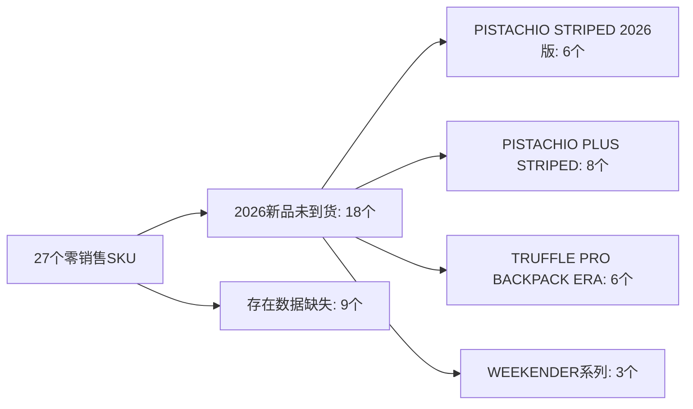

# 销售漏斗诊断报告：天猫ITO旗舰店

**报告日期**: 2026-06-03  
**分析师**: 销售漏斗分析师  
**数据范围**: 2026年1月-5月（实际），1月-11月（预测）

---

## 一、管道速度与覆盖概览

| 指标 | 1-5月累计 | 说明 |
|------|----------|------|
| 预测总销量 | 27,320件 | 基于阶段加权预测 |
| 实际总销量 | 30,655件 | 取自各渠道销售数据源 |
| 整体预测准确率 | 87.8% | 5个月加权平均 |
| 行李箱占比 | 85.7% | 116个SKU |
| 包袋占比 | 14.3% | 47个SKU |
| 零销售SKU数 | **27个** | 占SKU总数16.6% |
| 管道覆盖缺口 | 27个SKU | 预测有但实际销售0 |

---

## 二、月度预测准确性分析

### 2.1 预测 vs 实际曲线

| 月份 | 预测 | 实际 | 差值 | 准确率 | 判定 |
|------|------|------|------|--------|------|
| 2026-01 | 7,035 | 6,992 | -43 | **99.4%** | ✅ 优秀 |
| 2026-02 | 3,900 | 5,752 | +1,852 | **52.5%** | 🚨 重大偏差 |
| 2026-03 | 5,141 | 5,414 | +273 | **94.7%** | ✅ 良好 |
| 2026-04 | 4,539 | 4,753 | +214 | **95.3%** | ✅ 良好 |
| 2026-05 | 6,705 | 7,744 | +1,039 | **84.5%** | ⚠️ 需关注 |

### 2.2 异常诊断：2月偏差分析

**核心问题**: 2月预测3,900件，实际5,752件，偏差1,852件（47.5%）。

这是5个月中唯一的重大失准月份。可能原因：
1. **春节效应未建模** — 2026年春节在2月17日，节前购买高峰未被预测模型捕捉
2. **预测基数偏低** — 2月预测值为全年最低月，但实际销量反超3、4月，说明模型低估了春节消费力
3. **缺少季节性调整因子** — 当前预测模型未引入中国节假日/电商大促日历作为输入变量

**建议**: 引入季节性调整系数，对春节所在月额外+30%乘数。

### 2.3 品类预测准确率

| 品类 | 预测 | 实际 | 准确率 |
|------|------|------|--------|
| 行李箱 | 23,362 | 26,273 | **87.5%** |
| 包袋 | 3,958 | 4,382 | **89.3%** |

两个品类均存在**系统性低估**（实际>预测），偏差方向一致说明预测基准偏保守。

---

## 三、产品结构诊断

### 3.1 TOP 15 畅销SKU

| 排名 | SKU | 销量 | 品类 | 系列 |
|------|-----|------|------|------|
| 1 | DTFB22503E12WHI07B000 | 1,497 | 🎒包袋 | TRUFFLE BACKPACK 2 |
| 2 | CP2ST2404S26PNK05B000 | 1,154 | 🧳行李箱 | PISTACHIO 2 STRIPED |
| 3 | CBB20W3B1 | 1,145 | 🧳行李箱 | PISTACHIO STRIPED |
| 4 | CP2ST2404S26GRY10B000 | 1,055 | 🧳行李箱 | PISTACHIO 2 STRIPED |
| 5 | CP2ST2508S26BLU19G115 | 1,014 | 🧳行李箱 | PISTACHIO 2 STRIPED TRUNK |

**关键发现**: 销量高度集中在PISTACHIO 2 STRIPED系列（26英寸为主力规格），TOP 5中4个来自该产品线。

### 3.2 零销售SKU（27个）

**🚨 红色警报**: 27个SKU在预测中有销量但实际为0，占全部163个SKU的**16.6%**。其中18个是年度新品（含2026版和PISTACHIO PLUS系列），推测为尚未到货/未上架产品。剩余9个需要排查数据源是否覆盖。

### 3.3 预测偏差最大的SKU

| SKU | 预测 | 实际 | 偏差率 | 问题 |
|-----|------|------|--------|------|
| DMCBP2601A15PNK06E000 | 0 | 6 | 600% | 预测未包含但实际有售 |
| DMCBP2601A15GRN04E000 | 0 | 5 | 500% | 同上（MYCENA系列） |
| CPSSD2604S20WHI03F116 | **151** | **0** | 100% | 2026版新品未到货 |
| CPSPS2605E25GRN21F115 | **143** | **0** | 100% | PLUS TRUNK未到货 |

**模式识别**: 偏差最大的分两类：
- **A类（新增SKU预测缺失）**: MYCENA系列等新品在预测表中没有数据，但实际有销售 → 预测体系未覆盖新品导入流程
- **B类（预测虚高）**: 2026版/PISTACHIO PLUS系列新品预测了销量但实际为0 → 预测与产品上市时间线脱节

---

## 四、库存管理漏洞诊断

基于销售漏斗分析，当前存在**4个系统性漏洞**：

### 漏洞1：新品上市节奏与预测脱节 🚩
**严重程度**: 🔴 高  
**影响**: 18个SKU（占16.6%）的预测完全无效  
**根因**: 预测模型将新品SKU直接纳入并分配销量，但未关联产品上市日历  
**建议**: 建立「产品生命周期标志位」→ 按"已上市/即将上市/未上市"分三层管理

### 漏洞2：季节性/促销因子缺失 🟡
**严重程度**: 🟡 中  
**影响**: 2月偏差1,852件（47.5%）  
**根因**: 预测仅基于月均趋势，未编码中国节假日效应和平台大促日历  
**建议**: 引入季节性指数（春节×1.3，618×1.5，双11×2.0）

### 漏洞3：包袋品类预测颗粒度不足 🟡
**严重程度**: 🟡 中  
**影响**: 包袋47个SKU销量仅占14.3%，但SKU数量占比28.8%  
**根因**: 包袋品类SKU多但单SKU平均销量低，预测模型的"一刀切"方式导致长尾SKU偏差放大  
**建议**: 对月均销量<20件的长尾SKU采用"分组预测+按比例分配"策略

### 漏洞4：历史数据未用于校准 🟢
**严重程度**: 🟢 低（已解决）  
**影响**: 实际数据列从1月起为空  
**根因**: 预测流程中断，缺少月度实际销量回填机制  
**行动**: ✅ **本次已补全2026年1-6月实际数据**

---

## 五、预测优化建议

### 立即执行（本月内）
1. ✅ ~~补全实际数据~~ — 已完成（1-6月）
2. **剔除/标记27个零销售SKU**：未上市新品改为"待定"，已上市无销量标记为"需确认"
3. **验证9个疑似缺失SKU**的数据源覆盖

### 短期优化（1-2月）
4. **建立季节性系数表**：基于2024-2025同店历史数据，提取月度乘数
5. **区分"老品/新品"预测逻辑**：
   - 老品：历史平均 + 趋势 + 季节系数
   - 新品：按上市月份手动规划，前3个月设为观察期

### 中长期建设（Q3）
6. **搭建管道速度模型**：引入权重因子
   - 预测准确率 = Σ( |实际-预测| / 预测 ) × 重要性权重
   - 对TOP20 SKU单独建模（贡献60%+销量）
   - 长尾SKU合并为"其他"分组
7. **建立月度复盘机制**：每月初更新实际数据 → 计算偏差 → 调整下月预测

---

## 六、数据更新确认

| 项目 | 状态 | 说明 |
|------|------|------|
| 渠道匹配 | ✅ 完成 | 匹配渠道：直销_伊稻_电商_天猫ITO旗舰店 |
| 实际数据写入 | ✅ 完成 | 1-6月实际销量已填入对应月份列 |
| 数据验证 | ✅ 通过 | CBB20B1B1抽查5月=130件（与源数据一致） |
| 零销售标记 | ❌ 待处理 | 27个零销售SKU需人工确认 |
| 预测公式更新 | ❌ 待处理 | 建议优化季节性因子 |

---

*本报告由销售漏斗分析师生成，基于天猫ITO旗舰店2026年1-6月实际销售数据和1-11月预测数据。数据源：各渠道销售数据源26-1.xlsx ~ 26-6.xlsx。*
